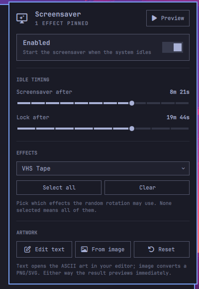

# Omarchy Screensaver Panel

A settings GUI for the [Omarchy](https://omarchy.org) screensaver — the knobs
that were previously config-file-and-CLI only, as a native shell panel.



Omarchy's screensaver (terminal text effects over your ASCII branding) is
lovely, but tuning it means editing `shell.json` by hand and there's no way to
choose *which* effects play. This plugin adds a bar icon that opens a panel
with:

- **Enable/disable** toggle (right-click the bar icon for a quick toggle)
- **Idle timing** sliders for screensaver and lock delay, with snap-to presets
  (30s–30m / 1m–60m), applied instantly
- **Effect picker** — pin any subset of the 37 `ttfx` effects for the random
  rotation (searchable multi-select, Select all / Clear); empty selection
  means all effects, exactly like stock
- **Artwork** controls — edit the ASCII art as text, generate it from a
  PNG/SVG, or reset to the Omarchy logo
- **Preview** button

Everything is built from Omarchy's own UI kit, so it follows your theme.

## Install

```bash
omarchy plugin add https://github.com/brianirish/omarchy-screensaver-panel.git --enable --yes
```

The widget lands in the bar's right section (move it with
`omarchy bar move brianirish.screensaver --section <left|center|right>`).

Everything except effect pinning works out of the box.

## Enabling effect pinning

Stock `omarchy-screensaver` always runs `ttfx --random-effect` over all
effects. To honor the effects you pin in the panel, install the bundled
override (a copy of the stock script that adds `--include-effects`):

```bash
sudo install -m 755 extras/omarchy-screensaver /usr/local/bin/omarchy-screensaver
```

One catch: Omarchy's `envs.lua` prepends `$OMARCHY_PATH/bin` to the session
PATH, ahead of `/usr/local/bin`, so the stock script would still win. Add this
at the end of `~/.config/hypr/hyprland.lua` (user config loads after Omarchy's
defaults) to put `/usr/local/bin` first:

```lua
-- /usr/local/bin overrides ahead of Omarchy's bin dir.
local omarchy_bin = (os.getenv("OMARCHY_PATH") or "/usr/share/omarchy") .. "/bin"
local path_entries = {}
for entry in (os.getenv("PATH") or "/usr/local/bin:/usr/bin"):gmatch("[^:]+") do
  if entry ~= omarchy_bin and entry ~= "/usr/local/bin" then
    table.insert(path_entries, entry)
  end
end
table.insert(path_entries, 1, omarchy_bin)
table.insert(path_entries, 1, "/usr/local/bin")
hl.env("PATH", table.concat(path_entries, ":"))
```

Then reload/relog. Pinned effects are stored inline on the widget's
`shell.json` entry; with none pinned the override behaves exactly like stock.

> The override is a fork of the stock script — if an `omarchy update` changes
> `/usr/share/omarchy/bin/omarchy-screensaver`, re-sync the copy.

## Uninstall

```bash
omarchy plugin remove brianirish.screensaver
sudo rm -f /usr/local/bin/omarchy-screensaver   # if you installed the override
```

(And drop the PATH block from `hyprland.lua` if you added it.)

## License

[MIT](LICENSE)
